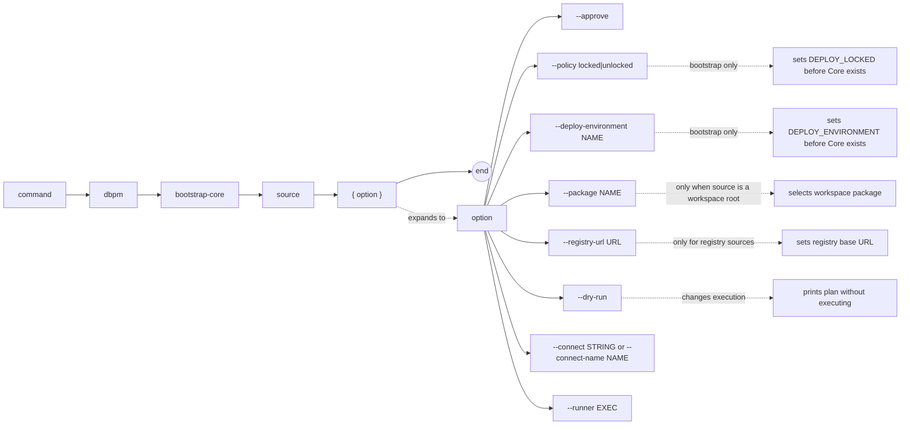

# dbpm bootstrap-core

Install or initialize Core, the dbpm in-database deployment substrate, into an empty or prepared schema. This command is required before any ordinary package deployments can run.

## Syntax

```
dbpm bootstrap-core source [--approve] [--package NAME]
                           [--policy locked|unlocked]
                           [--deploy-environment NAME]
                           [--registry-url URL] [--dry-run]
                           [--connect STRING | --connect-name NAME] [--runner EXEC]
```

## EBNF diagram



## Arguments

| Argument | Default | Description |
|---|---|---|
| `source` | required | Package source for the Core artifact. See [source types](source-types.md). |
| `--approve` | false | Approve policy-gated actions that would otherwise be blocked. |
| `--policy` | `unlocked` | Core bootstrap deployment-lock policy. `locked` writes `DEPLOY_LOCKED=Y`; `unlocked` writes `DEPLOY_LOCKED=N`. |
| `--deploy-environment` | none | Core `DEPLOY_ENVIRONMENT` label to write during bootstrap, such as `DEV`, `QLAB01`, `PLAB`, or `PROD`. |
| `--package` | none | Package name or application name to select when `source` is a workspace root. |
| `--registry-url` | `DBPM_REGISTRY_URL` or `https://registry.dbpm.io` | Registry base URL for `registry:` sources. |
| `--dry-run` | false | Print the deployment plan as JSON without executing. |
| `--connect` | `DBPM_CONNECT` | Raw SQL*Plus/SQLcl connect string. Mutually exclusive with `--connect-name`. |
| `--connect-name` | `DBPM_CONNECT_NAME` | SQLcl saved connection name. Requires SQLcl via `--runner` or `DBPM_SQL_RUNNER`. |
| `--runner` | `DBPM_SQL_RUNNER` or `sqlplus` | SQL runner executable. |

## Examples

Bootstrap Core from GitHub Packages:
```sh
dbpm bootstrap-core \
  gh-maven:512itconsulting/core:com.512itconsulting.database:core:3.5.0 \
  --connect user/pass@db
```

Bootstrap Core for a locked production-like schema:
```sh
dbpm bootstrap-core \
  gh-maven:512itconsulting/core:com.512itconsulting.database:core:3.5.0 \
  --policy locked \
  --deploy-environment PROD \
  --connect user/pass@db
```

Preview the plan without executing:
```sh
dbpm bootstrap-core \
  gh-maven:512itconsulting/core:com.512itconsulting.database:core:3.5.0 \
  --dry-run
```

## Notes

- Core uses its own bootstrap manifest because `pkg_application` does not exist until Core's own objects are created. The bootstrap path is distinct from the ordinary install path.
- Core 3.5.0 and newer require `DEPLOY_LOCKED` and `DEPLOY_ENVIRONMENT` during bootstrap. dbpm does not read Core deployment-lock policy before Core exists, so use `--policy` and `--deploy-environment` for bootstrap-time values.
- Run `dbpm check-core` after bootstrap to verify the installation.
- Core upgrades after initial bootstrap use `dbpm upgrade`, not `dbpm bootstrap-core`.
