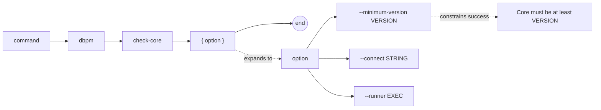

# dbpm check-core

Verify that Core is installed in the target database and optionally meets a minimum version requirement. This is a read-only command — it makes no changes.

## Syntax

```
dbpm check-core [--minimum-version VERSION] [--connect STRING] [--runner EXEC]
```

## EBNF diagram



## Arguments

| Argument | Default | Description |
|---|---|---|
| `--minimum-version` | none | Minimum acceptable Core version, such as `3.2.0`. If omitted, any installed Core version passes. |
| `--connect` | `DBPM_CONNECT` | SQLPlus/SQLcl connect string. |
| `--runner` | `DBPM_SQL_RUNNER` or `sqlplus` | SQL runner executable. |

## Output

On success:
```
CORE_VERSION=3.4.0
```

On failure, dbpm exits with code 2 and prints an error to stderr.

## Examples

Check that any Core version is installed:
```sh
dbpm check-core --connect user/pass@db
```

Check that Core meets a minimum version:
```sh
dbpm check-core --minimum-version 3.2.0 --connect user/pass@db
```

Using environment variables:
```sh
export DBPM_CONNECT=user/pass@db
dbpm check-core --minimum-version 3.0.0
```

## Notes

- Run `check-core` before any non-Core deployment to verify the substrate is ready.
- Core must be bootstrapped with `dbpm bootstrap-core` before ordinary package installs can run.
