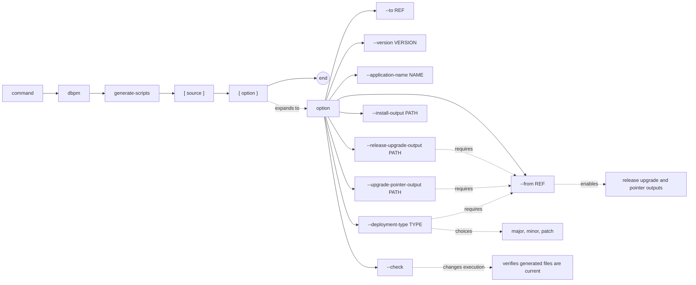

# dbpm generate-scripts

Generate standalone Oracle install and upgrade scripts from committed Git state.
The generated SQL can be executed by SQL*Plus or SQLcl without dbpm.

`generate-scripts` is intended for ordinary Core-dependent applications. Core
itself is intentionally unsupported because Core uses a bootstrap lifecycle that
differs from normal package deployments.

## Syntax

```text
dbpm generate-scripts [source] [--from REF] [--to REF]
                      [--version VERSION]
                      [--application-name NAME]
                      [--deployment-type major|minor|patch]
                      [--install-output PATH]
                      [--release-upgrade-output PATH]
                      [--upgrade-pointer-output PATH]
                      [--check]
```

## EBNF diagram



## Arguments

| Argument | Default | Description |
|---|---|---|
| `source` | `.` | Git repository root. dbpm resolves this to the repository top level. |
| `--from` | none | Baseline Git commit or ref used to build the upgrade diff. Must resolve to a commit when supplied. Omit for initial full-install-only generation. |
| `--to` | `HEAD` | Target Git commit or ref. Must resolve to a commit. |
| `--version` | `package.version` in `dbpm.yaml` | Target semantic version. Required when the repository has no dbpm manifest. |
| `--application-name` | normalized `package.name`, or repository directory name | Application registry name. The value is normalized the same way package names are normalized. |
| `--deployment-type` | inferred | Upgrade deployment type. Requires `--from`; normally inferred from the baseline and target versions. |
| `--install-output` | `scripts.install` in manifest, then `Deployment_Manifests/deploy.sql` | Full-install script path, relative to the repository root. |
| `--release-upgrade-output` | `generation.release_upgrade_output`, then `Deployment_Manifests/releases/{version}/update.sql` | Versioned upgrade script path, relative to the repository root. Requires `--from`; supports `{version}` and `<version>` placeholders. |
| `--upgrade-pointer-output` | `scripts.upgrade` in manifest, then `Deployment_Manifests/update.sql` | Current upgrade pointer script path, relative to the repository root. Requires `--from`. |
| `--check` | false | Do not write files. Fail if generated scripts are missing or stale. |

## Outputs

Without `--from`, the command is in initial deploy mode and renders only the
full-install script. With `--from`, the command renders three files:

| Output | Description |
|---|---|
| Full install | Deploys the current object tree at `--to`. |
| Versioned upgrade | Applies object changes between `--from` and `--to`. |
| Upgrade pointer | Includes the versioned upgrade script and passes through the deployment commit hash argument. |

When generated content differs from the files on disk, dbpm writes the changed
files and prints one `WROTE=path` line for each changed output. With `--check`,
dbpm writes nothing and prints `GENERATED_SCRIPTS_OK` only when every generated
file for the selected mode already matches.

## Manifest configuration

`generate-scripts` reads package identity and default script locations from
`dbpm.yaml` when present:

```yaml
package:
  name: demo
  version: "1.5.0"

scripts:
  install: Deployment_Manifests/deploy.sql
  upgrade: Deployment_Manifests/update.sql

generation:
  release_upgrade_output: Deployment_Manifests/releases/{version}/update.sql
```

CLI values override manifest values. Repositories without a dbpm manifest are
supported when `--version` is supplied; use `--application-name` when the
normalized repository directory name is not the desired Core application name.

## Table conventions

Canonical table DDL describes the current full-install shape:

```text
Tables/ORDERS.sql
```

Upgrade-specific table lifecycle scripts use the target release version:

```text
Tables/ORDERS.alter.1.5.0.sql
Tables/ORDERS.recreate.1.5.0.sql
Tables/OLD_ORDERS.drop.1.5.0.sql
```

- `alter` evolves an existing table without running canonical DDL.
- `recreate` runs immediately before the updated canonical DDL.
- `drop` removes an object and should normally call Core cleanup APIs such as
  `pkg_application.drop_and_forget_object_p`.

A modified canonical table without a matching `alter` or `recreate` script is
emitted as commented SQL in the upgrade script and reported as a warning.

## Type conventions

Type files may use generic SQL or explicit type spec/body extensions:

```text
Types/COUNTRY.sql
Types/ADDRESS.tps
Types/ADDRESS.tpb
```

- `*.sql` is treated as generic standalone type DDL.
- `*.tps` is treated as a type specification.
- `*.tpb` is treated as a type body.

Use `.tps` and `.tpb` when type spec/body ordering matters. dbpm does not
inspect SQL contents to infer whether a `.sql` file contains a type spec or
type body.

## Examples

Generate an initial full-install script from the current repository:

```sh
dbpm generate-scripts . --version 0.1.0
```

Generate install and upgrade scripts from a baseline:

```sh
dbpm generate-scripts . --from v0.1.0 --version 0.2.0
```

Generate from an explicit target ref:

```sh
dbpm generate-scripts . --from v1.4.0 --to release/1.5.0
```

Verify committed generated scripts in CI:

```sh
dbpm generate-scripts . --from v1.4.0 --to HEAD --check
```

Generate for a repository without `dbpm.yaml`:

```sh
dbpm generate-scripts . --from v1.4.0 --version 1.5.0 --application-name DEMO
```

Override output paths:

```sh
dbpm generate-scripts . \
  --from v1.4.0 \
  --version 1.5.0 \
  --install-output sql/install.sql \
  --release-upgrade-output sql/releases/{version}/update.sql \
  --upgrade-pointer-output sql/update.sql
```

## Notes

- `--to`, and `--from` when supplied, must name committed Git state.
  Working-tree and staged changes are not used for generation.
- Full installs contain canonical object and metadata files only. Upgrade
  scripts register new and modified objects with Core before applying object
  changes.
- Existing update files are not removed or checked when `--from` is omitted.
- Use [Convention-Driven SQL Generation](../script-generation.md) for the
  convention overview and
  [Convention-Driven SQL Generation Design](../script-generation-design.md) for
  the behavioral contract and deferred scope.
