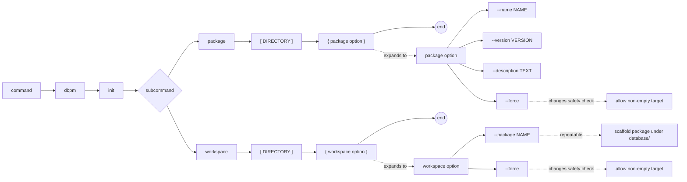

# dbpm init

Scaffold a new package or workspace directory with the standard folder layout,
a template manifest, and git-friendly placeholder files.

Package names must start with a lowercase letter and contain only lowercase
letters, digits, underscores (`_`), or hyphens (`-`). Names map to Oracle
application registry names by converting to uppercase and replacing hyphens
with underscores.

Valid examples: `core`, `my_package`, `utl-bs-numeric`

## Syntax

```
dbpm init package [DIRECTORY] [--name NAME] [--version VERSION] [--description TEXT] [--force]
dbpm init workspace [DIRECTORY] [--package NAME ...] [--force]
```

## EBNF diagram



## Subcommands

### package

Initialize a standalone dbpm package.

| Argument | Default | Description |
|---|---|---|
| `DIRECTORY` | `.` | Target directory to initialize. |
| `--name` | directory basename | Package name. Must start with a lowercase letter and contain only lowercase letters, digits, `_`, or `-`. |
| `--version` | `0.1.0` | Initial semantic version. |
| `--description` | *(empty)* | Short package description. |
| `--force` | off | Allow init in a non-empty directory. Existing files are never overwritten. |

Created layout:

```text
dbpm.yaml
README.md
LICENSE
.gitignore
deployment_manifests/
  .gitignore
docs/
examples/
functions/
helper_scripts/
metadata/
packages/
procedures/
tables/
tests/
types/
```

All leaf directories contain `.gitkeep` so the empty tree is tracked by git.
`deployment_manifests/` uses `.gitignore` instead to silently exclude log
files produced by SQL*Plus and SQLcl.

The generated `dbpm.yaml` includes all active fields needed for a minimal
deployment plus commented-out stanzas for optional fields: vendor, license,
Core version requirement, dependencies, extra script entry points, and
publishing config. The generated manifest is intended to be self-documenting
without cluttering a working package.

### workspace

Initialize a multi-package workspace.

| Argument | Default | Description |
|---|---|---|
| `DIRECTORY` | `.` | Target directory to initialize. |
| `--package NAME` | `my_package` | Package name to scaffold under `database/`. Repeatable. |
| `--force` | off | Allow init in a non-empty directory. Existing files are never overwritten. |

Created layout:

```text
dbpm-workspace.yaml
README.md
LICENSE
.gitignore
database/
  <pkg_name>/        (one per --package; full package scaffold inside)
    dbpm.yaml
    deployment_manifests/
    docs/
    functions/
    helper_scripts/
    metadata/
    packages/
    procedures/
    tables/
    tests/
    types/
helper_scripts/
os/
```

Each package directory is fully scaffolded and listed in `dbpm-workspace.yaml`.

## Output

Prints one `CREATED=<path>` line per file or directory created. Skipped files
(already present when `--force` is used) produce no output.

```text
CREATED=/path/to/my_package/dbpm.yaml
CREATED=/path/to/my_package/README.md
CREATED=/path/to/my_package/.gitignore
...
```

## Examples

Initialize a package in a new directory:

```sh
mkdir my_package
dbpm init package my_package --name my_package --description "My Oracle package"
```

Initialize a package in the current directory (name inferred from directory):

```sh
dbpm init package
```

Initialize a workspace with two packages:

```sh
mkdir my_workspace
dbpm init workspace my_workspace --package billing --package orders
```

Initialize in a partially populated directory:

```sh
dbpm init package my_package --force
```

With `--force`, only missing files and directories are created; nothing already
present is modified or overwritten.
