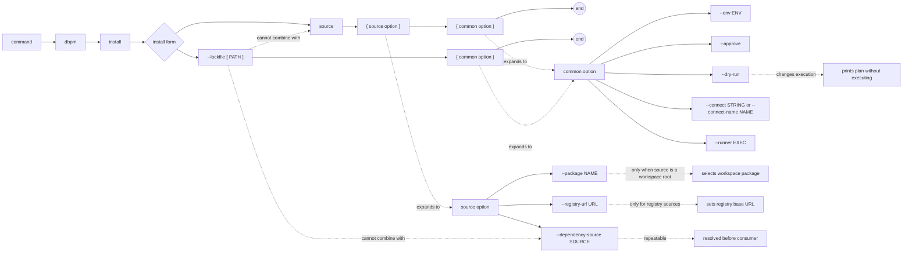

# dbpm install

Install a package that is not yet registered in Core. Fails if the package is already installed — use `dbpm upgrade` to move to a newer version or `dbpm reinstall` to destructively replace an existing installation.

## Syntax

```
dbpm install source [--env ENV] [--approve] [--dry-run]
                   [--package NAME]
                   [--dependency-source SOURCE]...
                   [--registry-url URL]
                   [--connect STRING | --connect-name NAME] [--runner EXEC]

dbpm install --lockfile [PATH] [--env ENV] [--approve] [--dry-run]
                        [--connect STRING | --connect-name NAME] [--runner EXEC]
```

## EBNF diagram



## Arguments

| Argument | Default | Description |
|---|---|---|
| `source` | required (unless `--lockfile`) | Package source. See [source types](source-types.md). |
| `--env` | `development` | Target environment name. |
| `--approve` | false | Approve policy-gated actions. |
| `--dry-run` | false | Print the deployment plan as JSON without executing. |
| `--package` | none | Package name or application name to select when `source` is a workspace root. |
| `--dependency-source` | none | Additional source that may satisfy a dependency declared in the manifest. Repeatable. Cannot be combined with `--lockfile`. |
| `--registry-url` | `DBPM_REGISTRY_URL` or `https://registry.dbpm.io` | Registry base URL for `registry:` sources. |
| `--lockfile` | `dbpm-lock.json` | Install from a resolved lockfile. If the flag is given without a value, defaults to `dbpm-lock.json`. Cannot be combined with `source` or `--dependency-source`. |
| `--connect` | `DBPM_CONNECT` | Raw SQL*Plus/SQLcl connect string. Mutually exclusive with `--connect-name`. |
| `--connect-name` | `DBPM_CONNECT_NAME` | SQLcl saved connection name. Requires SQLcl via `--runner` or `DBPM_SQL_RUNNER`. |
| `--runner` | `DBPM_SQL_RUNNER` or `sqlplus` | SQL runner executable. |

## Preflight checks

dbpm fails before running any deployment script if:

- The package is already installed with status `C` → use `dbpm upgrade` or `dbpm reinstall`.
- The package has a deployment in progress or failed (`R` or `F` status) → use `dbpm resume` or `dbpm reinstall`.
- Core is not installed or does not meet the package's `core.minimum_version`.
- A declared dependency is missing and no matching `--dependency-source` was provided.
- A declared dependency version cannot be satisfied by the provided source.

For `registry:` root sources, dbpm automatically resolves missing manifest dependencies from the same registry unless an explicit `--dependency-source` already satisfies them.

For workspace roots, dbpm selects the requested package root with `--package`. Sibling workspace packages may satisfy local development dependencies automatically, while explicit `--dependency-source` values take precedence.

## Lockfile installs

`--lockfile` reloads the artifact sources recorded in `dbpm-lock.json` (or a specified path) without restating package coordinates. Each artifact's SHA-256 checksum is verified against the lockfile before execution. Artifacts that match the lockfile checksum are served from the local content-addressed cache without re-downloading.

The resolved plan is verified to match the lockfile before any script runs. Drift between the lockfile and the current resolution fails loudly.

## Multi-package installs

When `--dependency-source` is provided (or when the manifest declares dependencies), dbpm builds a multi-package plan. Dependencies are installed before consumers. The full dependency graph must be resolvable before any script runs.

## Examples

Install from a local directory:
```sh
dbpm install ~/repos/utl_interval --connect user/pass@db
```

Install from GitHub Packages:
```sh
dbpm install \
  gh-maven:512itconsulting/utl_interval:com.512itconsulting.database:utl_interval:1.0.0 \
  --connect user/pass@db
```

Install with a dependency source:
```sh
dbpm install \
  gh-maven:rsantmyer/simple_scheduler:com.512itconsulting.database:simple_scheduler:1.1.0 \
  --dependency-source gh-maven:512itconsulting/utl_interval:com.512itconsulting.database:utl_interval:1.0.0 \
  --connect user/pass@db
```

Install from the dbpm registry:
```sh
dbpm install registry:simple_scheduler@^1.1.0 --connect user/pass@db
```

Install a package from a workspace root:
```sh
dbpm install ~/repos/my_workspace --package simple_scheduler --connect user/pass@db
```

Install from a lockfile:
```sh
dbpm install --lockfile --connect user/pass@db
```

Install from a lockfile at a custom path:
```sh
dbpm install --lockfile deploy/production.lock.json --env production --connect user/pass@db
```

Preview without executing:
```sh
dbpm install ~/repos/utl_interval --dry-run
```
