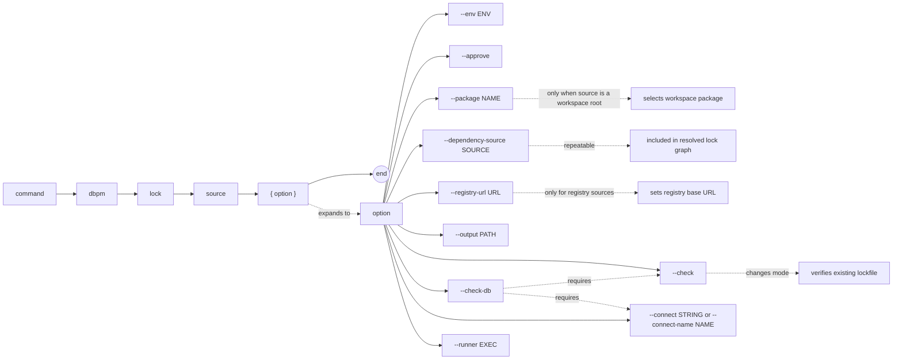

# dbpm lock

Write a dependency lockfile for a resolved install plan, or verify that an existing lockfile still matches the current source resolution.

## Syntax

```
dbpm lock source [--env ENV] [--approve]
               [--package NAME]
               [--dependency-source SOURCE]...
               [--registry-url URL]
               [--output PATH]
               [--check] [--check-db]
               [--connect STRING | --connect-name NAME] [--runner EXEC]
```

## EBNF diagram



## Arguments

| Argument | Default | Description |
|---|---|---|
| `source` | required | Package source. See [source types](source-types.md). |
| `--env` | `development` | Target environment name. |
| `--approve` | false | Approve policy-gated actions. |
| `--package` | none | Package name or application name to select when `source` is a workspace root. |
| `--dependency-source` | none | Additional source that may satisfy a dependency declared in the manifest. Repeatable. |
| `--registry-url` | `DBPM_REGISTRY_URL` or `https://registry.dbpm.io` | Registry base URL for `registry:` sources. |
| `--output` | `dbpm-lock.json` | Path to write the lockfile. |
| `--check` | false | Verify the existing lockfile matches the current source resolution instead of writing a new one. |
| `--check-db` | false | With `--check`: also verify that installed database versions and Core provenance rows match the lockfile. Requires `--connect` or `--connect-name`. |
| `--connect` | `DBPM_CONNECT` | SQL*Plus/SQLcl connect string. Required when using `--check-db` unless `--connect-name` is used. |
| `--connect-name` | `DBPM_CONNECT_NAME` | SQLcl named connection. Requires SQLcl via `--runner` or `DBPM_SQL_RUNNER`. |
| `--runner` | `DBPM_SQL_RUNNER` or `sqlplus` | SQL runner executable. |

## Output

Write mode:
```
WROTE_LOCKFILE=dbpm-lock.json
```

Check mode:
```
LOCKFILE_OK=dbpm-lock.json
```

On any mismatch, dbpm exits with code 2 and prints the mismatch details to stderr.

## What the lockfile records

For each package in the dependency graph:

- Package name, application name, and version
- Artifact URI (Maven URL or local path)
- SHA-256 checksum of the artifact
- Detached signature URL and publisher key fingerprint when supplied by a registry or lockfile
- Full provenance metadata (source commit, build ID, artifact coordinates)
- Dependency declarations

Lockfile installs use these records directly. The lockfile is the source of truth for `dbpm install --lockfile`.

## Examples

Write a lockfile:
```sh
dbpm lock gh-maven:rsantmyer/simple_scheduler:com.512itconsulting.database:simple_scheduler:1.1.0 \
  --dependency-source gh-maven:512itconsulting/utl_interval:com.512itconsulting.database:utl_interval:1.0.0
```

Write a lockfile from the dbpm registry:
```sh
dbpm lock registry:simple_scheduler@^1.1.0 --registry-url https://registry.dbpm.io
```

Write a lockfile for a package selected from a workspace:
```sh
dbpm lock ~/repos/my_workspace --package simple_scheduler
```

Verify the lockfile matches the current resolution (CI use):
```sh
dbpm lock gh-maven:rsantmyer/simple_scheduler:com.512itconsulting.database:simple_scheduler:1.1.0 \
  --dependency-source gh-maven:512itconsulting/utl_interval:com.512itconsulting.database:utl_interval:1.0.0 \
  --check
```

Verify the lockfile and confirm the database is at the locked versions:
```sh
dbpm lock gh-maven:rsantmyer/simple_scheduler:com.512itconsulting.database:simple_scheduler:1.1.0 \
  --dependency-source gh-maven:512itconsulting/utl_interval:com.512itconsulting.database:utl_interval:1.0.0 \
  --check --check-db --connect user/pass@db
```

Write to a custom path:
```sh
dbpm lock ./my_package --output deploy/my_package.lock.json
```

## Notes

- Commit `dbpm-lock.json` to source control for release-oriented deployments. This pins the exact artifact versions and checksums.
- `--check` is the recommended CI step: fail the build if the committed lockfile is out of date with the current manifest.
- `--check-db` is useful in integration environments to confirm the deployed state matches what was locked.
- `--check-db` requires `--check` and `--connect`.
- Lockfile provenance reconciliation (`--check-db`) requires Core 3.3.0 or newer.
