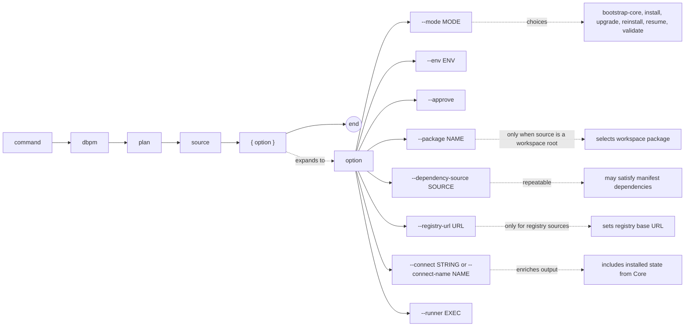

# dbpm plan

Generate and print a deployment plan as JSON without executing anything. Useful for inspecting what dbpm would do before committing to a deployment.

## Syntax

```
dbpm plan source [--mode MODE] [--env ENV] [--approve]
               [--package NAME]
               [--dependency-source SOURCE]...
               [--registry-url URL]
               [--connect STRING | --connect-name NAME] [--runner EXEC]
```

## EBNF diagram



## Arguments

| Argument | Default | Description |
|---|---|---|
| `source` | required | Package source. See [source types](source-types.md). |
| `--mode` | `install` | Deployment mode to plan. One of: `bootstrap-core`, `install`, `upgrade`, `reinstall`, `resume`, `validate`. |
| `--env` | `development` | Target environment name. |
| `--approve` | false | Approve policy-gated actions. |
| `--package` | none | Package name or application name to select when `source` is a workspace root. |
| `--dependency-source` | none | Additional source that may satisfy a dependency declared in the manifest. Repeatable. |
| `--registry-url` | `DBPM_REGISTRY_URL` or `https://registry.dbpm.io` | Registry base URL for `registry:` sources. |
| `--connect` | `DBPM_CONNECT` | Raw SQL*Plus/SQLcl connect string. Mutually exclusive with `--connect-name`. When provided, the plan includes the currently installed state from Core. |
| `--connect-name` | `DBPM_CONNECT_NAME` | SQLcl saved connection name. Requires SQLcl via `--runner` or `DBPM_SQL_RUNNER`. Also enables installed-state lookup. |
| `--runner` | `DBPM_SQL_RUNNER` or `sqlplus` | SQL runner executable. |

## Output

Prints a `dbpm.plan.v0` or `dbpm.multi-plan.v0` JSON object to stdout.

When `--connect` or `--connect-name` is provided, the plan includes `installed_state` for each package, enabling accurate preflight evaluation. Without database access, installed state is omitted and the plan reflects resolution only.

For upgrade with database access, if a stepwise chain is required, the output is a `dbpm.upgrade-chain.v0` plan with a `steps` array.

## Examples

Plan an install without a database connection:
```sh
dbpm plan gh-maven:512itconsulting/utl_interval:com.512itconsulting.database:utl_interval:1.0.0
```

Plan an upgrade with installed state:
```sh
dbpm plan gh-maven:512itconsulting/utl_interval:com.512itconsulting.database:utl_interval:1.2.0 \
  --mode upgrade --connect user/pass@db
```

Plan a multi-package install with a dependency:
```sh
dbpm plan gh-maven:rsantmyer/simple_scheduler:com.512itconsulting.database:simple_scheduler:1.1.0 \
  --dependency-source gh-maven:512itconsulting/utl_interval:com.512itconsulting.database:utl_interval:1.0.0
```

Plan from the dbpm registry:
```sh
dbpm plan registry:simple_scheduler@^1.1.0 --registry-url https://registry.dbpm.io
```

Plan a package from a workspace root:
```sh
dbpm plan ~/repos/my_workspace --package simple_scheduler
```

Plan a local package:
```sh
dbpm plan ~/repos/my_package --mode upgrade --connect user/pass@db
```

## Notes

- `plan` never writes to the database or modifies the lockfile.
- The plan output is the same JSON structure that `install`, `upgrade`, and other execution commands use internally. Reviewing it before deployment is good practice for production environments.
- Environment policy is evaluated in the plan. A `policy.result` of anything other than `allowed` means the execution commands will also fail unless `--approve` is passed.
