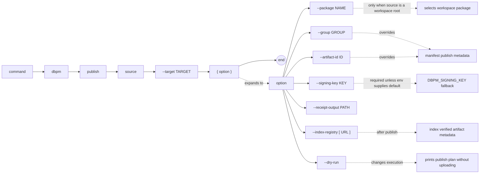

# dbpm publish

Build a ZIP artifact from a local package directory and publish it to a Maven-compatible repository (GitHub Packages or generic Maven). Signs the artifact with GPG and runs a post-publish verification step to confirm the artifact is accessible.

## Syntax

```
dbpm publish source --target TARGET
             [--package NAME]
             [--group GROUP] [--artifact-id ID]
             [--signing-key KEY]
             [--receipt-output PATH]
             [--index-registry [URL]]
             [--dry-run]
```

## EBNF diagram



## Arguments

| Argument | Default | Description |
|---|---|---|
| `source` | required | Local package directory or ZIP to publish. |
| `--target` | required | Repository to publish to. See [target formats](#target-formats). |
| `--package` | none | Package name or application name to select when `source` is a workspace root. |
| `--group` | `publish.group` in manifest | Maven group ID. Overrides the `publish:` section of `dbpm.yaml`. |
| `--artifact-id` | `publish.artifact_id` or package name | Maven artifact ID. Overrides the `publish:` section of `dbpm.yaml`. |
| `--signing-key` | `DBPM_SIGNING_KEY` | GPG key ID, fingerprint, or email used to sign the artifact. Required. |
| `--receipt-output` | package root/`dbpm-publish-receipt.json` | Path for the durable, secret-free publish receipt. ZIP sources default to the current directory. |
| `--index-registry [URL]` | none | Index the verified artifact after publishing. With no URL, uses `DBPM_REGISTRY_URL` or `https://registry.dbpm.io`. |
| `--dry-run` | false | Print what would be published without uploading. |

## Target formats

| Format | Example |
|---|---|
| GitHub Packages | `gh-maven:owner/repo` |
| Generic Maven | `maven:https://repo.example.com/maven2` |

## Manifest configuration

`dbpm publish` uses the dbpm package manifest (`dbpm.yaml`, `dbpm.yml`, `dbpm.json`, or `package.dbpm.yaml`) as the publishing source of truth. A checked-in `pom.xml` is not required for dbpm-native publishing.

Add a `publish:` section to `dbpm.yaml` to avoid repeating coordinates on every publish:

```yaml
publish:
  group: com.512itconsulting.database
  artifact_id: utl_interval   # optional; defaults to package.name
```

`group` is required if the `publish:` section is present and `--group` is not provided on the command line.

## Maven POM files

dbpm generates the uploaded `{artifact_id}-{version}.pom` from the package manifest and publish configuration. Repositories that are published only through `dbpm publish` may remove checked-in `pom.xml` files once no other build, CI, or legacy publishing workflow depends on them.

Checked-in `pom.xml` files are considered optional legacy compatibility. dbpm can still consume older ZIP artifacts that derive package metadata from a `pom.xml`, but new dbpm-native packages should prefer dbpm manifests.

## Package ignore file

When publishing from a package directory, dbpm honors a package-root `.dbpmignore` file. Ignored files are excluded from both local directory checksums and published ZIP artifacts.

The syntax is intentionally small:

- Blank lines and `#` comments are ignored.
- File patterns such as `pom.xml` or `*.log` match path components anywhere in the package.
- Directory patterns such as `assembly/` exclude that directory and its contents.
- Path patterns such as `docs/maven/**` match paths relative to the package root.
- Negation patterns such as `!deploy.sql` are not supported yet and fail with a clear error.

Example for a dbpm-native package after removing Maven publishing:

```gitignore
pom.xml
assembly/
```

`.dbpmignore` itself is included in the artifact unless it is explicitly ignored.

## Environment variables

| Variable | Description |
|---|---|
| `DBPM_SIGNING_KEY` | Default GPG key ID for `--signing-key`. |
| `DBPM_GITHUB_TOKEN` / `GITHUB_TOKEN` | Token for GitHub Packages targets. |
| `DBPM_MAVEN_TOKEN` | Token for generic Maven repository targets. |
| `DBPM_MAVEN_USER` | Username for generic Maven repository targets. |
| `DBPM_REGISTRY_URL` | Default registry URL for `--index-registry`. |
| `DBPM_REGISTRY_TOKEN` | Bearer token required by `--index-registry`. |
| `DBPM_REGISTRY_PUBLISHER` | Publisher override when `package.vendor` is absent. |
| `DBPM_REGISTRY_DESCRIPTION` | Description override when `package.description` is absent. |

## What gets uploaded

For each publish operation, dbpm uploads:

| File | Description |
|---|---|
| `{artifact_id}-{version}.zip` | The built artifact ZIP. |
| `{artifact_id}-{version}.zip.sha256` | SHA-256 checksum. |
| `{artifact_id}-{version}.zip.sha1` | SHA-1 checksum. |
| `{artifact_id}-{version}.zip.asc` | GPG detached ASCII-armor signature. |
| `{artifact_id}-{version}.pom` | Maven POM with dependency metadata. |
| `{artifact_id}-{version}.pom.sha256` | POM SHA-256 checksum. |
| `{artifact_id}-{version}.pom.sha1` | POM SHA-1 checksum. |
| `maven-metadata.xml` | Updated artifact-level metadata (version list). |
| `maven-metadata.xml.sha256` | Metadata SHA-256 checksum. |
| `maven-metadata.xml.sha1` | Metadata SHA-1 checksum. |

## Post-publish verification

After uploading, dbpm automatically verifies that:

1. The new version appears in `maven-metadata.xml`.
2. The artifact can be downloaded and its SHA-256 matches what was uploaded.

## Output

On success, dbpm prints:

```
PUBLISHED=https://maven.pkg.github.com/owner/repo/com/example/utl_interval/1.0.0/utl_interval-1.0.0.zip
WROTE_PUBLISH_RECEIPT=/path/to/package/dbpm-publish-receipt.json
```

The JSON receipt records the verified artifact URL, SHA-256 checksum, detached
signature URL, full primary GPG fingerprint, publish coordinates, and publication
time. It contains no repository credentials or registry tokens and is excluded
from later package artifacts automatically.

If `--index-registry` fails, dbpm exits nonzero but preserves the receipt so the
index request can be retried with `dbpm registry index`.

## Examples

```bash
# Dry run — show what would be published
dbpm publish ~/repos/utl_interval \
  --target gh-maven:512itconsulting/utl_interval \
  --signing-key signing@example.com \
  --dry-run

# Publish to GitHub Packages
dbpm publish ~/repos/utl_interval \
  --target gh-maven:512itconsulting/utl_interval \
  --signing-key $DBPM_SIGNING_KEY

# Publish, verify, write a receipt, and index the artifact
dbpm publish ~/repos/utl_interval \
  --target gh-maven:512itconsulting/utl_interval \
  --index-registry

# Publish to a generic Maven repository
dbpm publish ~/repos/utl_interval \
  --target maven:https://repo.example.com/maven2 \
  --group com.example.database \
  --signing-key $DBPM_SIGNING_KEY

# Publish a package selected from a workspace root
dbpm publish ~/repos/my_workspace \
  --package utl_interval \
  --target gh-maven:512itconsulting/utl_interval \
  --signing-key $DBPM_SIGNING_KEY
```
