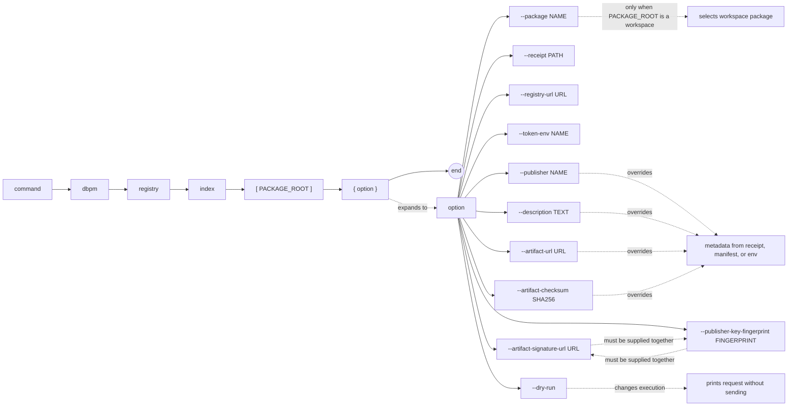

# dbpm registry index

Index metadata for an already-published immutable artifact. The registry stores
and verifies metadata; it does not receive the ZIP bytes from dbpm.

## Syntax

```text
dbpm registry index [PACKAGE_ROOT] [--package NAME] [--receipt PATH]
    [--registry-url URL] [--token-env NAME]
    [--publisher NAME] [--description TEXT]
    [--artifact-url URL] [--artifact-checksum SHA256]
    [--artifact-signature-url URL]
    [--publisher-key-fingerprint FINGERPRINT]
    [--dry-run]
```

## EBNF diagram



The command reads package identity, compatibility requirements, and dependencies
beyond Core from `dbpm.yaml`. It auto-discovers `dbpm-publish-receipt.json` in
the selected package root. Explicit flags override receipt and manifest values.

Publisher resolution order is `--publisher`, `DBPM_REGISTRY_PUBLISHER`, then
`package.vendor`. Description uses the equivalent description flag, environment
variable, and manifest field. The bearer token comes from the environment
variable named by `--token-env`, which defaults to `DBPM_REGISTRY_TOKEN`.

Every newly indexed version is `active`. Deprecation and yanking are separate
registry lifecycle operations.

## Examples

```bash
dbpm registry index . --dry-run
dbpm registry index .
./scripts/index-package.sh .

dbpm registry index . \
  --artifact-url https://repo.example/demo-1.2.3.zip \
  --artifact-checksum sha256:... \
  --artifact-signature-url https://repo.example/demo-1.2.3.zip.asc \
  --publisher-key-fingerprint ABCD1234...
```
