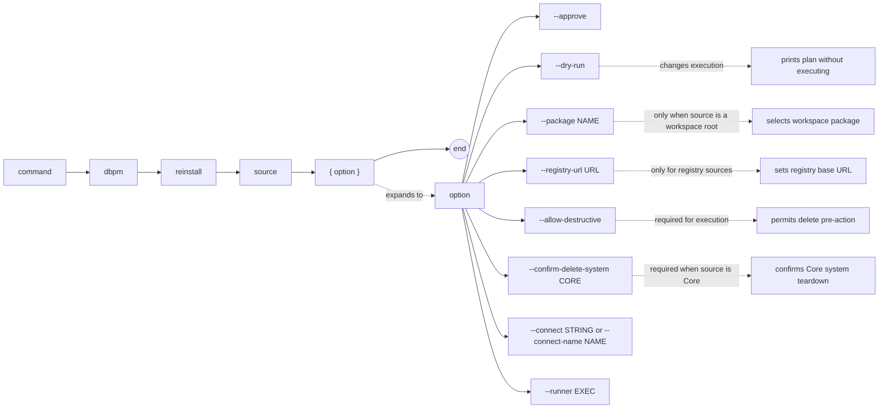

# dbpm reinstall

Destructively reinstall a package by deleting its existing Core application registration and running a fresh install. Intended for active development databases. Blocked when Core `DEPLOY_LOCKED=Y`.

For Core itself, reinstall is a full system teardown: dbpm calls `pkg_application.delete_system_p` with Core's required confirmation text, runs Core's `Deployment_Manifests/uninstall.core.sql`, then runs the Core install script.

## Syntax

```
dbpm reinstall source [--approve] [--dry-run]
                     [--package NAME] [--registry-url URL]
                     [--allow-destructive]
                     [--confirm-delete-system CORE]
                     [--connect STRING | --connect-name NAME] [--runner EXEC]
```

## EBNF diagram



## Arguments

| Argument | Default | Description |
|---|---|---|
| `source` | required | Package source. See [source types](source-types.md). |
| `--approve` | false | Approve policy-gated actions. |
| `--dry-run` | false | Print the deployment plan as JSON without executing. |
| `--package` | none | Package name or application name to select when `source` is a workspace root. |
| `--registry-url` | `DBPM_REGISTRY_URL` or `https://registry.dbpm.io` | Registry base URL for `registry:` sources. |
| `--allow-destructive` | false | Required to allow the destructive pre-action (application deletion). Without this flag, dbpm fails before touching the database. |
| `--confirm-delete-system` | none | Required for Core reinstall. Must be exactly `CORE`. |
| `--connect` | `DBPM_CONNECT` | Raw SQL*Plus/SQLcl connect string. Mutually exclusive with `--connect-name`. |
| `--connect-name` | `DBPM_CONNECT_NAME` | SQLcl saved connection name. Requires SQLcl via `--runner` or `DBPM_SQL_RUNNER`. |
| `--runner` | `DBPM_SQL_RUNNER` or `sqlplus` | SQL runner executable. |

## Preflight checks

dbpm fails before running any script if:

- `--allow-destructive` is not provided.
- Core `DEPLOY_LOCKED=Y`.
- The package is Core and `--confirm-delete-system CORE` is not provided.
- The package has installed dependents. The names of the blocking dependents are reported. Dependents must be reinstalled or removed first.

Unlike `upgrade`, reinstall does not block based on deployment status — it can recover a package in any state.

## Examples

Reinstall a local package in development:
```sh
dbpm reinstall ~/repos/utl_interval --allow-destructive --connect user/pass@db
```

Preview the destructive plan:
```sh
dbpm reinstall ~/repos/utl_interval --allow-destructive --dry-run
```

Reinstall Core in a disposable schema:
```sh
dbpm reinstall gh-maven:512itconsulting/core:com.512itconsulting.database:core:3.5.0 \
  --allow-destructive \
  --confirm-delete-system CORE \
  --connect user/pass@db
```

## Notes

- `reinstall` calls `pkg_application.delete_application_p` before running the install script. This removes the Core application registration and any dependent records.
- Core reinstall is special because Core blocks `delete_application_p` for itself. It calls `pkg_application.delete_system_p` with confirmation text and requires Core `DEPLOY_LOCKED=N`, then runs `Deployment_Manifests/uninstall.core.sql` before reinstalling Core. Treat this as equivalent to wiping dbpm-managed state from the schema.
- Installed applications that depend on the target block reinstall. Reinstall the dependents first, or reinstall them together as separate commands.
- Multi-package dependency ordering is not yet supported for reinstall. Run reinstall commands individually in the correct order (consumers before dependencies).
- Use `dbpm resume` when a previous deployment failed but data should be preserved. Use `dbpm reinstall` only when a clean slate is acceptable.
