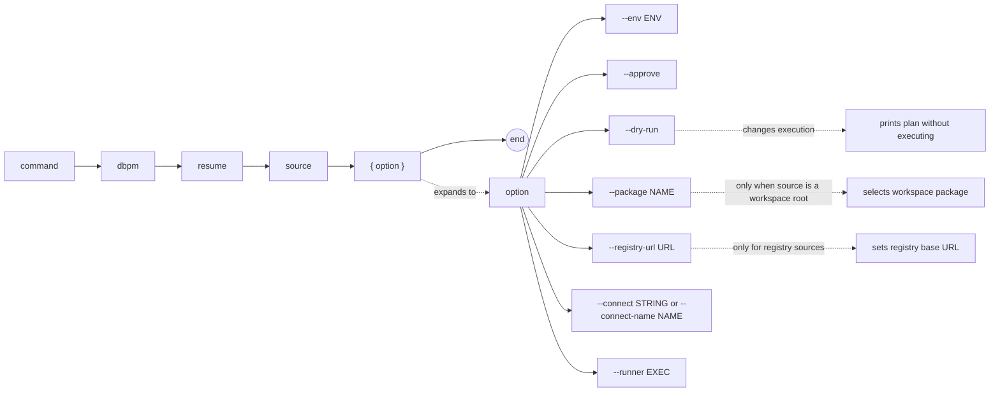

# dbpm resume

Re-run the deployment script for a package whose Core deployment status is `R` (running) or `F` (failed). Preserves the existing application registration and any data already written — this is the roll-forward path after a partial or failed deployment.

## Syntax

```
dbpm resume source [--env ENV] [--approve] [--dry-run]
                  [--package NAME] [--registry-url URL]
                  [--connect STRING | --connect-name NAME] [--runner EXEC]
```

## EBNF diagram



## Arguments

| Argument | Default | Description |
|---|---|---|
| `source` | required | Package source. See [source types](source-types.md). |
| `--env` | `development` | Target environment name. |
| `--approve` | false | Approve policy-gated actions. |
| `--dry-run` | false | Print the deployment plan as JSON without executing. |
| `--package` | none | Package name or application name to select when `source` is a workspace root. |
| `--registry-url` | `DBPM_REGISTRY_URL` or `https://registry.dbpm.io` | Registry base URL for `registry:` sources. |
| `--connect` | `DBPM_CONNECT` | Raw SQL*Plus/SQLcl connect string. Mutually exclusive with `--connect-name`. |
| `--connect-name` | `DBPM_CONNECT_NAME` | SQLcl saved connection name. Requires SQLcl via `--runner` or `DBPM_SQL_RUNNER`. |
| `--runner` | `DBPM_SQL_RUNNER` or `sqlplus` | SQL runner executable. |

## Preflight checks

dbpm fails before running any script if:

- The package is not installed → use `dbpm install`.
- The package has a complete (`C`) deployment status → no resume needed.
- The package has a status other than `R` or `F`.

## When to use resume

| Scenario | Command |
|---|---|
| Deployment script failed partway through | `dbpm resume` |
| Deployment was interrupted (status `R`) | `dbpm resume` |
| Package is not yet installed | `dbpm install` |
| Want a clean-slate reinstall | `dbpm reinstall` |

## Examples

Resume after a failed deployment:
```sh
dbpm resume ~/repos/utl_interval --connect user/pass@db
```

Resume from GitHub Packages:
```sh
dbpm resume \
  gh-maven:512itconsulting/utl_interval:com.512itconsulting.database:utl_interval:1.0.0 \
  --connect user/pass@db
```

Preview the resume plan:
```sh
dbpm resume ~/repos/utl_interval --dry-run --connect user/pass@db
```

## Notes

- `resume` re-runs the full deployment script from the beginning. Deployment scripts should be idempotent — safe to re-run after a partial execution.
- `resume` does not call `pkg_application.delete_application_p`. Application registration and data are preserved.
- For upgrade failures, `resume` re-runs all upgrade steps from step 1 (including chain steps). The same idempotency requirement applies.
