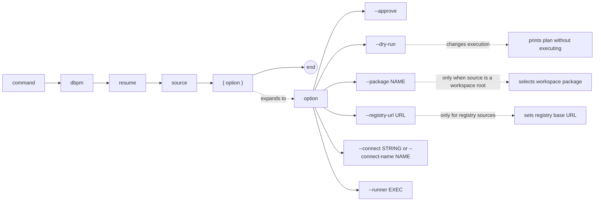

# dbpm resume

Roll an interrupted deployment forward from its durable composite-operation
evidence. Database scripts are replayed only when the database phase is not
confirmed complete. If Core records `DATABASE_COMPLETE` or
`RUNTIME_UNREACHABLE`, resume continues with runtime work without running the
database install or upgrade again.

## Syntax

```
dbpm resume [source | --application NAME] [--approve] [--dry-run]
                  --runtime-prefix PATH
                  [--package NAME] [--registry-url URL]
                  [--connect STRING | --connect-name NAME] [--runner EXEC]
```

## EBNF diagram


```mermaid
flowchart LR
    command["command"] --> dbpm["dbpm"]
    dbpm --> resume["resume"]
    resume --> source["source"]
    source --> options["{ option }"]
    options --> end_node(("end"))

    options -. expands to .-> option["option"]
    option --> approve["--approve"]
    option --> dry_run["--dry-run"]
    option --> package["--package NAME"]
    option --> registry_url["--registry-url URL"]
    option --> connect["--connect STRING or --connect-name NAME"]
    option --> runner["--runner EXEC"]

    package -. only when source is a workspace root .-> package_note["selects workspace package"]
    registry_url -. only for registry sources .-> registry_note["sets registry base URL"]
    dry_run -. changes execution .-> dry_run_note["prints plan without executing"]
```

## Arguments

| Argument | Default | Description |
|---|---|---|
| `source` | optional with `--application` | Package source. Recovery prefers the checksum-verified installed lifecycle receipt when available. |
| `--application` | inferred from source/receipt | Installed application operation to resume. |
| `--runtime-prefix` | required for runtime recovery | Runtime prefix containing the installed lifecycle receipt. |
| `--approve` | false | Approve policy-gated actions. |
| `--dry-run` | false | Print the deployment plan as JSON without executing. |
| `--package` | none | Package name or application name to select when `source` is a workspace root. |
| `--registry-url` | `DBPM_REGISTRY_URL` or `https://registry.dbpm.io` | Registry base URL for `registry:` sources. |
| `--connect` | `DBPM_CONNECT` or structured database variables | Raw SQL*Plus/SQLcl connect string. `DBPM_DB_USER`, `DBPM_DB_PASSWORD`, and `DBPM_DB_DSN` are composed when the raw value is unset. Mutually exclusive with `--connect-name`. |
| `--connect-name` | `DBPM_CONNECT_NAME` | SQLcl saved connection name. Requires SQLcl via `--runner` or `DBPM_SQL_RUNNER`. |
| `--runner` | `DBPM_SQL_RUNNER` or `sqlplus` | SQL runner executable. |

## Preflight checks

dbpm fails before running any script if:

- The package is not installed → use `dbpm install`.
- Core has no recoverable composite operation for the application.
- The composite operation is already `VALIDATED`.
- The package has a status other than `R` or `F`.
- Core `DEPLOY_LOCKED=Y` and `--approve` is not provided.

## When to use resume

| Scenario | Command |
|---|---|
| Deployment script failed partway through | `dbpm resume source` |
| Deployment was interrupted (status `R`) | `dbpm resume` |
| Database completed but runtime failed | `dbpm resume --application APP --runtime-prefix PATH` |
| Runtime host was temporarily unreachable | `dbpm runtime reconcile` |
| Package is not yet installed | `dbpm install` |
| Want a clean-slate reinstall | `dbpm reinstall` |

## Examples

Resume after a failed deployment:
```sh
dbpm resume ~/repos/utl_interval --connect user/pass@db
```

Resume from GitHub Packages:
```sh
dbpm resume \
  gh-maven:512itconsulting/utl_interval:com.512itconsulting.database:utl_interval:1.0.0 \
  --connect user/pass@db
```

Preview the resume plan:
```sh
dbpm resume ~/repos/utl_interval --dry-run --connect user/pass@db
```

## Notes

- Resume acquires a fenced Core-held lease and increments the operation attempt
  before doing work. An unexpired lease held by another attempt fails closed.
- Evidence from an older attempt is reverified. Confirmed database completion
  is never replayed merely because the current attempt number changed.
- When database completion cannot be confirmed, deployment scripts are replayed
  and therefore remain required to be idempotent.
- `resume` does not call `pkg_application.delete_application_p`. Application registration and data are preserved.
- For upgrade failures, `resume` re-runs all upgrade steps from step 1 (including chain steps). The same idempotency requirement applies.
