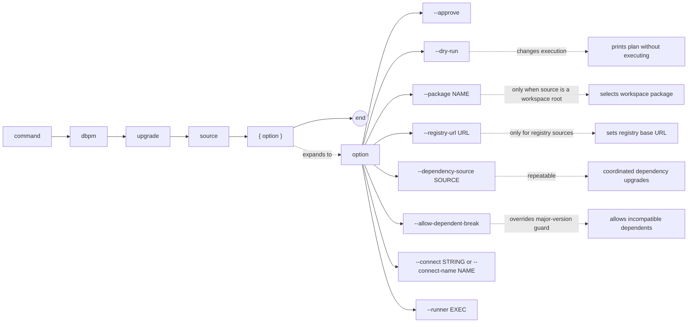

# dbpm upgrade

Move an installed package to a higher semantic version. The package must already be installed with a complete (`C`) Core deployment status.

## Syntax

```
dbpm upgrade source [--approve] [--dry-run]
                   [--package NAME] [--registry-url URL]
                   [--dependency-source SOURCE]...
                   [--allow-dependent-break]
                   [--connect STRING | --connect-name NAME] [--runner EXEC]
```

## EBNF diagram



## Arguments

| Argument | Default | Description |
|---|---|---|
| `source` | required | Package source at the target version. See [source types](source-types.md). |
| `--approve` | false | Approve policy-gated actions. |
| `--dry-run` | false | Print the deployment plan as JSON without executing. When `--connect` is also provided, the plan reflects the actual installed version and shows a chain plan if one is required. |
| `--package` | none | Package name or application name to select when `source` is a workspace root. |
| `--registry-url` | `DBPM_REGISTRY_URL` or `https://registry.dbpm.io` | Registry base URL for `registry:` sources. |
| `--dependency-source` | none | Additional source that may satisfy a dependency. Used for coordinated major-version upgrades where a dependent package also needs upgrading. Repeatable. |
| `--allow-dependent-break` | false | Allow a major version upgrade even when installed dependents may have incompatible constraints. |
| `--connect` | `DBPM_CONNECT` | Raw SQL*Plus/SQLcl connect string. Mutually exclusive with `--connect-name`. |
| `--connect-name` | `DBPM_CONNECT_NAME` | SQLcl saved connection name. Requires SQLcl via `--runner` or `DBPM_SQL_RUNNER`. |
| `--runner` | `DBPM_SQL_RUNNER` or `sqlplus` | SQL runner executable. |

## Preflight checks

dbpm fails before running any script if:

- The package is not installed → use `dbpm install`.
- The package has an incomplete or failed deployment (`R` or `F` status) → use `dbpm resume`.
- The target version is the same as the installed version.
- The target version is lower than the installed version (downgrade not supported).
- The target is a major version bump and there are installed dependents with potentially incompatible constraints → provide updated dependents via `--dependency-source` or use `--allow-dependent-break`.

## Upgrade chain planning

For Maven sources, dbpm automatically chains through published minor-version milestones when the installed version cannot be directly upgraded to the target. The chain uses the `scripts.upgrade_from` constraint declared in the manifest:

- If `upgrade_from` is present and satisfied by the installed version → direct upgrade (single step).
- If `upgrade_from` is absent or not satisfied → dbpm reads the Maven repository's published version list and builds a chain through the lowest published patch of each intermediate minor.

Example: installed `1.0.2`, target `1.3.0`, published versions include `1.1.0`, `1.2.0`:
```
1.0.2 → 1.1.0 → 1.2.0 → 1.3.0
```

Each step is a full upgrade plan executed sequentially. The installed state is re-queried from Core between steps.

For local and ZIP sources, if `upgrade_from` is not satisfied, dbpm fails with guidance to provide intermediate sources manually.

## Major version upgrades with dependents

A major version upgrade (`x.y.z → (x+1).y.z`) is a breaking change. If installed packages declare a dependency on the current major, they may break. dbpm blocks the upgrade and names the incompatible dependents:

```
dbpm: Cannot upgrade ABC from 1.3.0 to 2.0.0;
installed dependents may have incompatible constraints: DEF.
Provide updated dependent versions with --dependency-source,
or use --allow-dependent-break to override.
```

**Recommended workflow** — supply the updated dependent alongside the upgrade:
```sh
dbpm upgrade new-ABC-2.0 --dependency-source new-DEF-2.0 --connect user/pass@db
```

dbpm upgrades the dependency (ABC) first, then the consumer (DEF), in the correct order.

**Escape hatch** — force the major upgrade and handle the dependent separately:
```sh
dbpm upgrade new-ABC-2.0 --allow-dependent-break --connect user/pass@db
```

## Examples

Upgrade from a local directory:
```sh
dbpm upgrade ~/repos/utl_interval --connect user/pass@db
```

Upgrade from GitHub Packages:
```sh
dbpm upgrade \
  gh-maven:512itconsulting/utl_interval:com.512itconsulting.database:utl_interval:1.2.0 \
  --connect user/pass@db
```

Coordinated major version upgrade:
```sh
dbpm upgrade \
  gh-maven:rsantmyer/simple_scheduler:com.512itconsulting.database:simple_scheduler:2.0.0 \
  --dependency-source gh-maven:512itconsulting/utl_interval:com.512itconsulting.database:utl_interval:2.0.0 \
  --connect user/pass@db
```

Preview the chain plan without executing:
```sh
dbpm upgrade \
  gh-maven:512itconsulting/utl_interval:com.512itconsulting.database:utl_interval:1.3.0 \
  --dry-run --connect user/pass@db
```

## Notes

- Upgrade scripts should be idempotent. If an upgrade fails, fix the issue and run `dbpm resume`.
- The `scripts.upgrade_from` field in the manifest controls whether a direct upgrade is safe. See [source types](source-types.md) for constraint syntax.
- Minor and patch upgrades do not check for dependent compatibility — only major version bumps are blocked.
