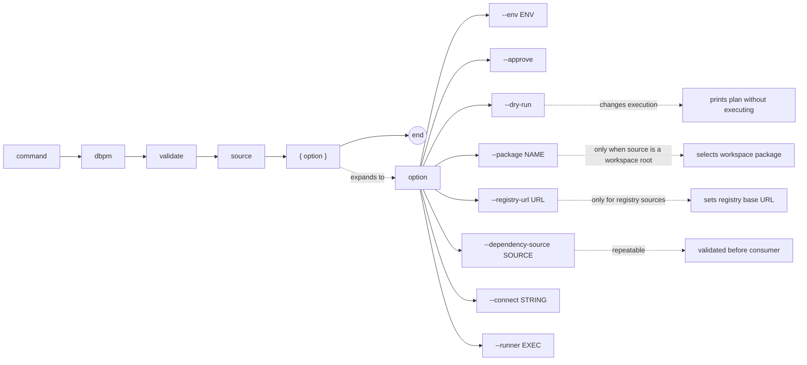

# dbpm validate

Run the validation or smoke-test script declared in the package manifest (`scripts.validate`). The package must be installed and complete.

## Syntax

```
dbpm validate source [--env ENV] [--approve] [--dry-run]
                    [--package NAME] [--registry-url URL]
                    [--dependency-source SOURCE]...
                    [--connect STRING] [--runner EXEC]
```

## EBNF diagram



## Arguments

| Argument | Default | Description |
|---|---|---|
| `source` | required | Package source. See [source types](source-types.md). |
| `--env` | `development` | Target environment name. |
| `--approve` | false | Approve policy-gated actions. |
| `--dry-run` | false | Print the validation plan as JSON without executing. |
| `--package` | none | Package name or application name to select when `source` is a workspace root. |
| `--registry-url` | `DBPM_REGISTRY_URL` or `https://registry.dbpm.io` | Registry base URL for `registry:` sources. |
| `--dependency-source` | none | Additional source for a dependency whose validation script should also run. Repeatable. |
| `--connect` | `DBPM_CONNECT` | Connect string. |
| `--runner` | `DBPM_SQL_RUNNER` or `sqlplus` | SQL runner executable. |

## Preflight checks

dbpm fails before running any script if:

- The package is not installed → use `dbpm install`.
- The package does not have a complete (`C`) deployment status.

## Multi-package validation

When `--dependency-source` is provided, dbpm validates dependency sources before the consuming package, in dependency order. This is useful for confirming that all packages in a deployment graph are functioning correctly after a multi-package install or upgrade.

## Examples

Validate a locally installed package:
```sh
dbpm validate ~/repos/utl_interval --connect user/pass@db
```

Validate a package from GitHub Packages:
```sh
dbpm validate \
  gh-maven:512itconsulting/utl_interval:com.512itconsulting.database:utl_interval:1.0.0 \
  --connect user/pass@db
```

Validate a consumer and its dependency in order:
```sh
dbpm validate \
  gh-maven:rsantmyer/simple_scheduler:com.512itconsulting.database:simple_scheduler:1.1.0 \
  --dependency-source gh-maven:512itconsulting/utl_interval:com.512itconsulting.database:utl_interval:1.0.0 \
  --connect user/pass@db
```

Preview the validation plan:
```sh
dbpm validate ~/repos/utl_interval --dry-run --connect user/pass@db
```

## Notes

- If the manifest does not declare `scripts.validate`, the command fails with a clear error.
- Validation scripts receive no arguments by default. The script is responsible for querying Core for installed state if needed.
- Validate is a read-only operation from Core's perspective — it does not update deployment status.
