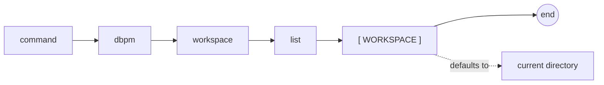

# dbpm workspace

Inspect a dbpm workspace manifest.

## Syntax

```
dbpm workspace list [WORKSPACE]
```

## EBNF diagram



## Arguments

| Argument | Default | Description |
|---|---|---|
| `WORKSPACE` | `.` | Workspace root directory or `dbpm-workspace.yaml` path. |

## Workspace manifest

Workspace manifests use `dbpm-workspace.yaml` at the repository root:

```yaml
workspace:
  packages:
    - database/utl_interval
    - database/simple_scheduler
```

Each package path is relative to the workspace root and must contain its own dbpm package manifest.

## Output

Prints JSON with the workspace root, manifest path, and package summaries:

```json
{
  "workspace_root": "/repos/my_workspace",
  "manifest": "/repos/my_workspace/dbpm-workspace.yaml",
  "packages": [
    {
      "path": "database/utl_interval",
      "absolute_path": "/repos/my_workspace/database/utl_interval",
      "manifest": "dbpm.yaml",
      "name": "utl_interval",
      "application_name": "UTL_INTERVAL",
      "version": "1.0.0"
    }
  ]
}
```

## Examples

```sh
dbpm workspace list
dbpm workspace list ~/repos/my_workspace
```

Use a workspace package with normal commands:

```sh
dbpm plan ~/repos/my_workspace --package simple_scheduler
dbpm publish ~/repos/my_workspace --package utl_interval --target gh-maven:512itconsulting/utl_interval
```
